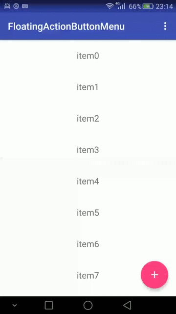

# FloatingActionButtonMenu
[  ](https://bintray.com/lynnchurch/maven/floating-action-button-menu/_latestVersion)
# Description
Use FloatingActionButtonMenu to wrap android.support.design.widget.FloatingActionButton.  



# Usage
**1.** Add a dependency to your `build.gradle`:
```
dependencies {
    compile 'me.lynnchurch:floating-action-button-menu:1.0.0'
}
```
**2.** Add the `me.lynnchurch.library.FloatingActionButtonMenu` to your layout XML file.  
```XML
<me.lynnchurch.library.FloatingActionButtonMenu
        android:id="@+id/fab_menu"
        android:layout_width="wrap_content"
        android:layout_height="wrap_content"
        android:layout_gravity="bottom|end"
        android:gravity="center"
        android:orientation="vertical">
        <android.support.design.widget.FloatingActionButton
            android:id="@+id/card_giftcard"
            android:layout_width="wrap_content"
            android:layout_height="wrap_content"
            android:src="@drawable/ic_card_giftcard_white_24dp"
            app:fabSize="mini"/>
        <android.support.design.widget.FloatingActionButton
            android:id="@+id/backup"
            android:layout_width="wrap_content"
            android:layout_height="wrap_content"
            android:src="@drawable/ic_backup_white_24dp"
            app:fabSize="mini"/>
        <android.support.design.widget.FloatingActionButton
            android:id="@+id/grade"
            android:layout_width="wrap_content"
            android:layout_height="wrap_content"
            android:src="@drawable/ic_grade_white_24dp"
            app:fabSize="mini"/>
</me.lynnchurch.library.FloatingActionButtonMenu>
```  
**3.** Set `OnMenuItemClickListener` in code:  
```JAVA
FloatingActionButtonMenu fabMenu = (FloatingActionButtonMenu) findViewById(R.id.fab_menu);
fabMenu.setOnMenuItemClickListener(new FloatingActionButtonMenu.OnMenuItemClickListener()
{
    @Override
    public void onMenuItemClick(FloatingActionButton button, int btnId)
    {
         switch (btnId)
        {
            case R.id.card_giftcard:
                Toast.makeText(MainActivity.this, "card_giftcard", Toast.LENGTH_SHORT).show();
                break;
            case R.id.backup:
                Toast.makeText(MainActivity.this, "backup", Toast.LENGTH_SHORT).show();
                break;
            case R.id.grade:
                Toast.makeText(MainActivity.this, "grade", Toast.LENGTH_SHORT).show();
                break;
            default:
        }
    }
});
```
**4.** And you can set `app:layout_behavior`:
```
app:layout_behavior="me.lynnchurch.library.ScrollAwareFABMenuBehavior"
```
